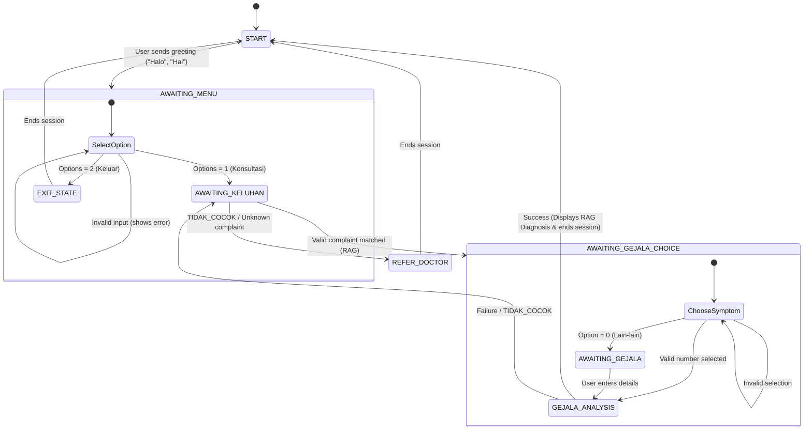

# 🏥 Medika WhatsApp Medical Consultation Bot (RAG)

A professional WhatsApp chatbot designed for medical consultations and RAG (Retrieval-Augmented Generation) lookup using **Gemini 2.0 Flash**, **Gemini Embeddings**, and **Google Cloud Firestore Vector Search**. 

The bot assists patients with empathetic health consultation in Bahasa Indonesia by searching a vetted medical knowledge base in Firestore, asking clarifying questions, and recommending initial at-home steps or urging professional care.

---

## 🌟 Key Features

- **Retrieval-Augmented Generation (RAG)**: Integrates Firestore's native vector similarity search (`findNearest`) with Gemini's AI model to guarantee responses are strictly grounded in an approved medical knowledge base.
- **Empathetic Indonesian Dialogue**: Always communicates using warm, supportive, and professional Bahasa Indonesia.
- **Interactive State Machine**: Guides the user from a welcome menu, records their medical complaint, offers relevant symptom choices from the database, and provides target recommendations.
- **Session Expiry & GC**: Standard 30-minute session TTL (Time To Live) that automatically prompts users on inactivity timeout. Includes an in-memory garbage collection sweep every 10 minutes to avoid memory leaks.
- **Strict Guardrails**: Rejects off-topic prompts (coding, math, small talk) with a polite refusal template, and gracefully handles unknown conditions with `TIDAK_COCOK` triggering a direct recommendation to see a physician.
- **Reliable WhatsApp Client**: Powered by `whatsapp-web.js` with local authentication session persistency (`LocalAuth`), automatic retry logic, and headless Chrome optimization.
- **Graceful Shutdown**: Listens to `SIGINT` / `SIGTERM` signals to cleanly destroy the browser process and prevent Chrome lock errors on subsequent restarts.

---

## 🛠️ Tech Stack

- **Runtime**: Node.js (ES Modules)
- **WhatsApp Bridge**: `whatsapp-web.js` & `qrcode-terminal`
- **Database / Vector Search**: Firebase Admin SDK & Google Cloud Firestore
- **AI Platform**: Google GenAI SDK (`@google/genai`)
  - **LLM Model**: `gemini-2.0-flash`
  - **Embedding Model**: `gemini-embedding-2` (768-dimensional outputs)

---

## 📁 File Structure

```text
telemedicine/
├── src/
│   ├── index.js       # Main server entrypoint (WhatsApp event loop & bot logic)
│   ├── firebase.js    # Firebase Admin wrapper & RAG vector search execution
│   ├── session.js     # In-memory Session Manager with TTL expiry and GC
│   └── ingest.js      # One-off CLI script to embed and upload CSV to Firestore
├── .env               # Local configuration and API keys (ignored by git)
├── .gitignore         # Version control exclusion rules
├── firebase-service-account.json # Secret Firebase credentials (ignored by git)
├── Medika_KnowledgeBase_.csv     # Source medical data (ignored by git)
├── package.json       # Project dependencies and script definitions
└── README.md          # Project documentation
```

---

## 🚀 Setup & Installation

### 1. Prerequisites
- **Node.js**: v18 or newer (v26 is fully supported).
- **Puppeteer Chrome**: Puppeteer requires a compatible headless shell executable configured on your host OS.

### 2. Installation
Clone or navigate to the workspace directory and install dependencies:
```bash
npm install
```

### 3. Environment Configuration
Create a `.env` file in the root of the project:
```ini
PORT=3000
GEMINI_API_KEY=your_gemini_api_key_here
```

### 4. Firebase Credentials
Place your project service account JSON file in the root directory and rename it to:
`firebase-service-account.json`

> ⚠️ **Security Warning:** Never commit `.env` or `firebase-service-account.json` to public repositories. They are already listed in the `.gitignore` for your safety.

---

## 📥 Ingesting the Medical Knowledge Base

Before running the bot, populate the Firestore database with the contents of your medical CSV spreadsheet.

1. Ensure `Medika_KnowledgeBase_.csv` is placed in the project root.
2. Run the ingestion command:
   ```bash
   node src/ingest.js
   ```

*Note: The script includes built-in rate-limiting delays to respect the Gemini API quota and features a **resume function** that automatically skips rows already loaded in Firestore.*

---

## 🏃 Running the Bot

Start the main bot client:
```bash
node src/index.js
```

1. A QR code will display in your terminal.
2. Scan the QR code using your mobile WhatsApp client (**Linked Devices**).
3. Once connected, the console will print `✅ WhatsApp client connected and ready! Bot is live.`
4. To stop the bot, press `Ctrl + C` (triggers a graceful exit, releasing the Puppeteer browser).

---

## 🤖 Interaction Flow (State Machine)



---

## 🛡️ RAG Guardrails & Safety

- **Vector Search Similarity Limit**: Validated documents must maintain a Cosine Distance of $\le 0.3$ (equivalent to $\ge 70\%$ similarity).
- **Out of Scope Refusal**: Direct instructions prevent the AI from responding to general programming, calculations, or casual conversations, steering the conversation back to medical services.
- **Medical Disclaimer**: Every successful diagnosis includes a prominent warning that the bot is a supportive tool and is not a substitute for professional healthcare.
